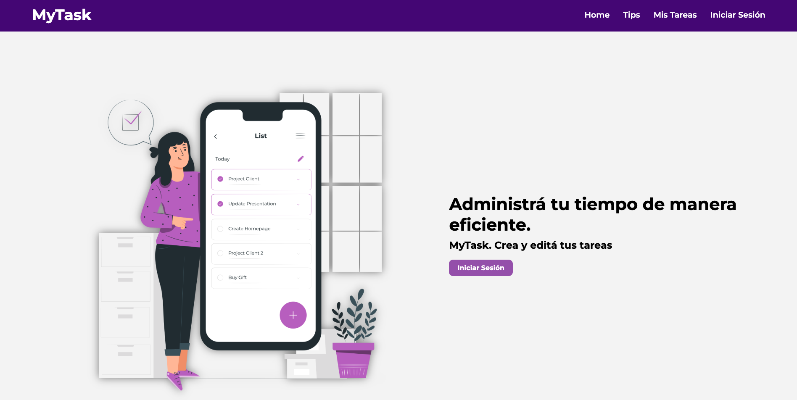
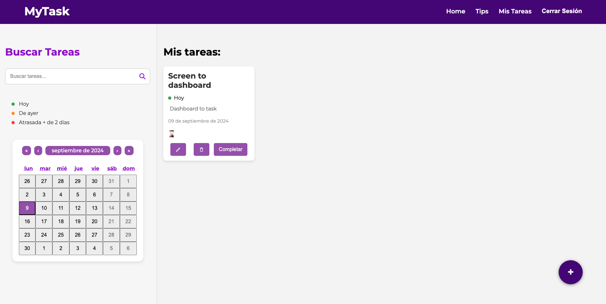
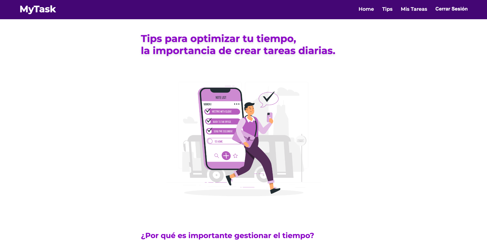

<h1>My Task 1.0</h1>

First CRUD project - Full stack app. 

You can visit web site      

<a href="https://my-task-frontend-beta.vercel.app/" target="_blank" style="display: inline-block; padding: 8px 15px; font-size: 12px; color: white; background-color: #4B0082; border-radius: 10px; text-decoration: none;">
  CLICK HERE
</a>

In <strong>MyTask </strong> you can create daily task to organize you day. 
Besides yo can watch status of each one activities, this will help in your time optimization. All this through a friendly and nice user interface.

<h3>&#128640;  Main languages and tools to development:</h3>

- <strong>React.js</strong>
- <strong> JavaScript </strong>
- <strong> Node.js </strong> 
- <strong> Vite </strong> 

<h3>🗂️ Frameworks used: </h3>

- Styled Component
- Framer Motion
- Axios
- Formik
- Yup
- React Calendar
- Dotenv

You can see the backend code in my GitHub profile. 

<h3>Screens: </h3>

Home: 

 

Dashboard: 

 
Tips Page: 

 

